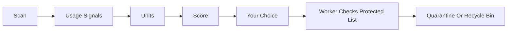

<!-- lang -->

[](README.tr.md)

# DustyBytes

Windows disk cleaner, by purpose.

## Numbers First

| What | Count | Source |
|---|---|---|
| Open source repositories reviewed | 61, in 7 reports | `docs/inceleme/` |
| Tests passing | 339 (scan 18, signals 24, units 40, safety 46, uninstall 105, cleaning 27, UI 79) | `dotnet test` |
| Full scan of `C:\` with the MFT reader | 8.6 s, 2.84 M files | one machine, n=1 |
| Full scan of `C:\` with `FindFirstFileEx` | 33.2 s, 2.90 M files | same machine |
| Installed programs detected | 199 (47 MSI, 53 MSIX) | same machine |
| Cleanable found in preview | about 26.5 GB in 45 k files, nothing deleted | same machine |

The scan numbers come from one machine. They show the MFT path does not run slower; they are not a benchmark.

## What It Is

DustyBytes scans a Windows drive and lists what takes space and has not been used for a long time. It groups files by purpose — a game, a film, a program, a build folder, a cache — instead of showing a raw file tree. Each group has a size, a last-used date, a confidence level and a reason. You remove what you pick; nothing goes away without a quarantine or a recycle bin step. Programs are uninstalled through their own uninstaller, then their leftovers are found and quarantined.

## Doesn't Windows Already Do This?

Storage Sense and Disk Cleanup clear temp files, the recycle bin and old Windows Update files. WinDirStat and WizTree show where the bytes are. Both are good at their job. DustyBytes adds:

- **Purpose, not folders.** A Steam game is one line with its launcher, not 40 000 files under `steamapps`.
- **When you last used it.** Launcher records, Prefetch, UserAssist and media history give a last-used date; the list is sorted by size and idle time together.
- **Leftover-free uninstall.** After the vendor uninstaller runs, registry keys, AppData folders, services and shortcuts that belonged to the program are found, scored and quarantined.
- **A protected list the UI cannot bypass.** Every delete request goes through the elevated worker, which checks it against system, cloud and shared-runtime rules.

## Features

- **Two scanners.** `FindFirstFileEx` works everywhere; the MFT reader works on NTFS with admin rights and keeps a USN cursor for quick rescans.
- **Units.** Nine extractors turn the scan into games, programs, films, series, developer artifacts, caches, browser caches, installers and system artifacts.
- **Usage signals.** Steam, Epic, GOG and other launchers, Prefetch, UserAssist and recent media; the source and reliability of each date is shown.
- **Quarantine.** Removed items move to a quarantine folder on the same drive with a manifest; they can be restored until they are purged. Items older than 3 days (default, unmeasured) are purged the next time the elevated worker runs; the option can be turned off on the Quarantine screen.
- **Uninstaller.** Win32, MSI and MSIX programs; registry export before removal; leftovers scored High, Medium or Low confidence.
- **Cleaning rules.** 23 JSON rule files (browser caches, Windows temp, crash dumps, app caches) and optional `winapp2.ini`, plus DISM component cleanup, Windows Update cache and Delivery Optimization.

## What It Does Not Do

- No registry "cleaning" of orphan keys that no program owns.
- No `DISM /ResetBase`; a test fails the build if it appears.
- No deletion inside OneDrive or other cloud placeholder folders, and no following of junctions or symlinks.
- No direct delete: every removal is quarantine, recycle bin or a rule with its own policy.
- No defragmentation, no driver updates, no "PC speed-up".
- No telemetry. Nothing leaves the machine.
- No signed release yet; Windows SmartScreen will warn.

## Installation

Windows 10 version 2004 (build 19041) or later, x64.

The quickest way is the [Releases](https://github.com/Teknesyum/DustyBytes/releases) page: download `DustyBytes-win-x64.zip`, check it against the `.sha256` file next to it, unzip and run `DustyBytes.exe`. The build is self-contained, so no .NET install is needed. It is not code-signed yet, so SmartScreen may warn on first launch.

To build from source you need the .NET 10 SDK.

From a clone, double-click `Kur.bat`. It opens the install window, builds the program and writes a desktop shortcut. Set `KUR_PROVA=1` for a dry run that installs to a temporary folder and writes no shortcut.

To build by hand:

```powershell
dotnet publish src/DustyBytes.App -c Release -r win-x64 --self-contained -o bin
```

The UI runs without admin rights. The first delete, uninstall or MFT scan asks for elevation once, for the worker process.

## How It Works



Scan, then read usage signals, then group into units, then score, then you choose, then the elevated worker checks the protected list, then the item goes to quarantine or the recycle bin.

The score is `log2(1 + MB) × idle weight × confidence`. Idle weight grows with the logarithm of days since last use and reaches 1 at two years; an unknown date counts as 0.5. The UI process never touches files. It sends requests over a named pipe that only the same user SID can open; the worker also checks that the caller is its parent process. More flows are in [docs/diagram.md](docs/diagram.md).

## The Program Shows What It Does

- **Overview** — drive usage, scan progress with the current folder, and the largest units. *(screenshot)*
- **Suggestions** — units sorted by score, each with size, last used, confidence and reason. *(screenshot)*
- **Map** — a squarified treemap of the scan; click to go down a level. *(screenshot)*
- **Programs** — installed programs with size and last use; uninstall shows the leftover list before anything is removed. *(screenshot)*
- **Cleaning** — rule groups with a preview of size and file count. *(screenshot)*
- **Quarantine** — what was removed, when, and a restore button. *(screenshot)*
- **Update badge** — a dot and "Update" at the top right: yellow means a new version is out, click to download it in the background; green means it is downloaded and SHA-256 verified, click to install. Installing asks first and says the program will close and reopen on the new version. *(screenshot)*

## For Developers

```powershell
dotnet build DustyBytes.slnx
```

```powershell
dotnet test DustyBytes.slnx
```

Set `DUSTYBYTES_DRYRUN=1` to run every delete, uninstall and cleaning path without changing the disk.

| Project | Role |
|---|---|
| `DustyBytes.Core` | Model, scoring, protected list, IPC messages |
| `DustyBytes.Scan` | `FindFirstFileEx` scanner, MFT reader, USN journal |
| `DustyBytes.Signals` | Launcher libraries, Prefetch, UserAssist, media |
| `DustyBytes.Units` | Extractors that turn the scan into units |
| `DustyBytes.Clean` | Quarantine, uninstaller, leftovers, cleaning rules |
| `DustyBytes.Worker` | Elevated worker, named pipe server and client |
| `DustyBytes.App` | Avalonia 11 UI |

Rules live in `rules/` as JSON and are copied next to the executable. The code is AOT compatible: `System.Text.Json` source generators only, no reflection. Borrowed algorithms and data are listed in [docs/licenses.md](docs/licenses.md).

## Contributing

Open an issue first, then send a small pull request. Code, commits and issues are in English. Contributions are accepted under the project license, AGPL-3.0-or-later; there is no CLA or DCO. New cleaning rules are welcome as JSON files in `rules/cleaners/`. Sponsorship keeps development going; the badge is at the bottom of this page.

## License

AGPL-3.0-or-later. See [LICENSE](LICENSE).

<!-- signature -->
<div align="center">

<a href="https://github.com/sponsors/Teknesyum"></a>
&nbsp;
<a href="LICENSE"></a>

</div>
