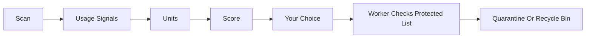

<!-- lang -->

[](README.tr.md)

# DustyBytes

Windows disk cleaner, by purpose.

## Numbers First

| What | Count | Source |
|---|---|---|
| Open source repositories reviewed | 61, in 7 reports | `docs/inceleme/` |
| Tests passing | 987 (scan 49, signals 24, units 71, safety 134, uninstall 222, cleaning 82, UI 405) | `dotnet test` |
| Full scan of `C:\` with the MFT reader | 8.6 s, 2.84 M files | one machine, n=1 |
| Full scan of `C:\` with `FindFirstFileEx` | 33.2 s, 2.90 M files | same machine |
| Installed programs detected | 199 (47 MSI, 53 MSIX) | same machine |
| Cleanable found in preview | about 26.5 GB in 45 k files, nothing deleted | same machine |

The scan numbers come from one machine. They show the MFT path does not run slower; they are not a benchmark.

## What It Is

DustyBytes scans a Windows drive and lists what takes space and has not been used for a long time. It groups files by purpose — a game, a film, a program, a build folder, a cache — instead of showing a raw file tree. Each group has a size, a last-used date, a confidence level and a reason. You remove what you pick; nothing goes away without a quarantine or a recycle bin step. Programs are uninstalled through their own uninstaller, then their leftovers are found and quarantined.

## Doesn't Windows Already Do This?

Storage Sense and Disk Cleanup clear temp files, the recycle bin and old Windows Update files. WinDirStat and WizTree show where the bytes are. Both are good at their job. DustyBytes adds:

- **Purpose, not folders.** A Steam game is one line with its launcher, not 40 000 files under `steamapps`.
- **When you last used it.** Launcher records, Prefetch, UserAssist and media history give a last-used date; the list is sorted by size and idle time together.
- **Leftover-free uninstall.** After the vendor uninstaller runs, registry keys, AppData folders, services and shortcuts that belonged to the program are found, scored and quarantined.
- **It names what is big.** "LM Studio · Language model, 40 GB" instead of a folder path, with one plain sentence on what happens if it goes. Items under 1 GB stay out of the way unless you ask for them.
- **One click, no dialog.** Each card has its own button. It quarantines at once and the toast offers Undo.
- **A protected list the UI cannot bypass.** Every delete request goes through the elevated worker, which checks it against system, cloud and shared-runtime rules.

## Features

- **Two scanners.** `FindFirstFileEx` works everywhere; the MFT reader works on NTFS with admin rights and keeps a USN cursor for quick rescans.
- **Units.** Ten extractors turn the scan into games, programs, app content, films, series, developer artifacts, caches, browser caches, installers and system artifacts.
- **Known content.** `rules/known-content.json` names 24 heavy locations: local AI models (LM Studio, Ollama, Hugging Face, Jan, GPT4All, InvokeAI), Android emulators, Steam shader cache, Adobe caches and package caches (npm, pnpm, Yarn, NuGet, Gradle, Maven, pip, uv, Cargo, Go). Docker, WSL and iPhone backups are left out on purpose: moving their files is the wrong way to remove them.
- **Usage signals.** Steam, Epic, GOG and other launchers, Prefetch, UserAssist and recent media; the source and reliability of each date is shown.
- **Quarantine.** Removed items move to a quarantine folder on the same drive with a manifest; they can be restored until they are purged. Items older than 7 days are purged while the elevated worker runs: when it starts and every hour after that. The Quarantine screen can empty everything at once, and automatic purge can be turned off there.
- **Uninstaller.** Win32, MSI and MSIX programs; registry export before removal; leftovers scored High, Medium or Low confidence.
- **Cleaning rules.** 23 JSON rule files (browser caches, Windows temp, crash dumps, app caches) and optional `winapp2.ini`, plus DISM component cleanup, Windows Update cache and Delivery Optimization.
- **Every drive.** All fixed drives are scanned, each with its own index; the overview has a drive selector with "All" as the default.
- **Space without deleting.** "Compress" shrinks a game or program with transparent Windows compression (NTFS, reversible). OneDrive files not opened for a long time can go "online only": they stay in the cloud and download again when opened.
- **More sources.** Recycle bin, downloads not opened for 90 days (quarantined, never purged at once) and the hibernation file.
- **Duplicate files.** Found in the background after a scan; each group keeps one copy you choose. Copies only go to quarantine, and the worker re-hashes them at the moment of removal.
- **Force and bulk uninstall.** A program with a missing or broken uninstaller can be force-removed: only high-confidence traces go to quarantine, registry keys are backed up first. Several programs can be uninstalled in one queue, silently where the uninstaller allows it.
- **Reminders.** A weekly user-level check measures free space and shows a Windows notification when it runs low; it never deletes. Explorer's right-click menu gets "DustyBytes ile incele" (inspect with DustyBytes).
- **One button.** The overview shows "Safe to delete: X — Clean": caches, temp files and other non-personal items, one click and no questions. It stays off until the scan ends and says why. "More space: Y GB, K decisions" asks about the rest in groups ("4 games unused for 12+ months, 112 GB"), with Enter, Esc and the arrow keys.
- **A target.** "I need 60 GB" builds the least painful plan: the safe set first, then what has gone unused longest. It says how much frees now and how much waits in quarantine.
- **Honest counters.** "Freed now X · In quarantine Y (frees in N days)" comes from the bytes the worker actually removed, not from estimates. "Free space now" empties the quarantine with two presses.
- **Undo a whole cleanup.** Each cleanup is a session. The quarantine screen groups by session with "Restore all", and every cleanup ends with a before/after panel.
- **Preview equals execution.** For cleaning rules the worker builds the file list, the screen shows it, and only files in that list are touched. The result line reads "Shown 1,204 files, deleted 1,198, skipped 6 (in use)". The full list stays inside the worker.
- **What grew?** A small per-folder snapshot is kept for 30 days; the overview names the three folders that grew most since the last scan, and the weekly notification mentions it.
- **Plain explanations.** Every rule and every kind of item answers "What is it?", "What happens if I delete it?" and "Does it come back?". Browser cookies are a separate, unticked option, so sites stay signed in.
- **Quiet uninstall.** MSI, Inno Setup, NSIS and Squirrel uninstallers are recognised and run silently in the bulk queue; unknown ones run visibly. Shared runtimes (.NET, VC++, DirectX, Java, WebView2) start unticked.
- **Notifications with a budget.** At most one a week, only when 5 GB or more can be freed or free space is below 10 %. "Clean safely" runs the safe set from the notification itself; "Mute this week" and "Never show again" are on it too.
- **Local measurements.** `olcum.jsonl` in the app data folder records time to first card, time to first freed byte, decisions and clicks. Nothing leaves the machine.
- **What is inside?** Under the safe clean button the total is broken down item by item, largest first: name, file count, size and one line on what it is. Each item opens to its largest files with a reveal-in-folder link, and "Skip this" leaves it out.
- **See before you delete.** Film, series, folder, game and program cards list their largest files. Videos play and pictures open in your default app, pictures show a thumbnail, and every file can be shown in File Explorer. Only audio, video and image files ever open; programs, scripts and shortcuts never do.
- **Pick files, then remove them.** The contents list shows every file, largest first, fifty at a time. Tick the ones you want, play or open any of them, and quarantine the selection; the card shrinks by what went. The worker refuses any path outside that card.
- **What you actually got.** After a safe clean the summary reads the free space on each drive before and after, so the number is what the disk gained, not an estimate. Items that could not go are listed with the reason and what to do ("close Code and try again").
- **A plan, not a pile of numbers.** The overview splits the space into three steps: safe (one click), unused (look and pick), in use (information only). Each step says how it is freed. The cleaning screen ticks the recommended options and folds the rest away.

## What It Does Not Do

- No registry "cleaning" of orphan keys that no program owns.
- No `DISM /ResetBase`; a test fails the build if it appears.
- No deletion inside OneDrive or other cloud placeholder folders, and no following of junctions or symlinks.
- No direct delete: every removal is quarantine, recycle bin or a rule with its own policy.
- No defragmentation, no driver updates, no "PC speed-up".
- No telemetry. Nothing leaves the machine.
- Releases are not code-signed. On first launch SmartScreen shows "Windows protected your PC": click **More info**, then **Run anyway**. The `.sha256` file proves the download is the published one.

## Installation

**Recommended: Teknesyum Base Pro (Windows).** This repository is private, and only the Pro build of [Teknesyum Base](https://github.com/Teknesyum/Teknesyum-Base) lists private repositories; the public Base lists public ones only. Open Base Pro, find **DustyBytes** in the list and install it. It also updates and removes it later, and needs no admin rights.

**Or install manually.**

Windows 10 version 2004 (build 19041) or later, x64.

**With the installer.** Put `Kur.bat` and `kur-dustybytes.ps1` from this repository in one folder and double-click `Kur.bat`. It asks GitHub for the latest release, downloads `DustyBytes-win-x64.zip` with its `.sha256` file and refuses to install if the checksum does not match.

The program goes to `%LOCALAPPDATA%\Programs\DustyBytes` (change it with Değiştir before pressing Kur), so no admin rights are needed. It writes a desktop and a Start menu shortcut. On an update it closes a running copy and keeps the old version until the new one is in place. The log is `%LOCALAPPDATA%\DustyBytes\kurulum.log`.

Set `KUR_PROVA=1` for a dry run that installs to a temporary folder and writes no shortcut. `KUR_OTOMATIK=1` runs without a window and exits with 0 or 1.

**By hand.** From the [Releases](https://github.com/Teknesyum/DustyBytes/releases) page, download `DustyBytes-win-x64.zip`, check it against the `.sha256` file next to it, unzip and run `DustyBytes.exe`. The build is self-contained, so no .NET install is needed. It is not code-signed, so SmartScreen warns on first launch: **More info**, then **Run anyway**.

**From source.** You need the .NET 10 SDK:

```powershell
dotnet publish src/DustyBytes.App -c Release -r win-x64 --self-contained -o bin
```

The UI runs without admin rights. The first delete, uninstall or MFT scan asks for elevation once, for the worker process.

## How It Works



Scan, then read usage signals, then group into units, then score, then you choose, then the elevated worker checks the protected list, then the item goes to quarantine or the recycle bin.

The score is `log2(1 + MB) × idle weight × confidence`. Idle weight grows with the logarithm of days since last use and reaches 1 at two years; an unknown date counts as 0.5. The UI process never touches files. It sends requests over a named pipe that only the same user SID can open; the worker also checks that the caller is its parent process. More flows are in [docs/diagram.md](docs/diagram.md).

## The Program Shows What It Does

- **Overview** — drive usage, scan progress with the current folder, and the largest units. *(screenshot)*
- **Suggestions** — units sorted by score, each with size, last used, confidence and reason. *(screenshot)*
- **Map** — a squarified treemap of the scan; click to go down a level. *(screenshot)*
- **Programs** — installed programs with size and last use; uninstall shows the leftover list before anything is removed. *(screenshot)*
- **Cleaning** — rule groups with a preview of size and file count. *(screenshot)*
- **Quarantine** — what was removed, when, and a restore button. *(screenshot)*
- **Update badge** — a dot and "Update" at the top right: yellow means a new version is out, click to download it in the background; green means it is downloaded and SHA-256 verified, click to install. Installing asks first and says the program will close and reopen on the new version. *(screenshot)*

## For Developers

```powershell
dotnet build DustyBytes.slnx
```

```powershell
dotnet test DustyBytes.slnx
```

Set `DUSTYBYTES_DRYRUN=1` to run every delete, uninstall and cleaning path without changing the disk.

| Project | Role |
|---|---|
| `DustyBytes.Core` | Model, scoring, protected list, IPC messages |
| `DustyBytes.Scan` | `FindFirstFileEx` scanner, MFT reader, USN journal |
| `DustyBytes.Signals` | Launcher libraries, Prefetch, UserAssist, media |
| `DustyBytes.Units` | Extractors that turn the scan into units |
| `DustyBytes.Clean` | Quarantine, uninstaller, leftovers, cleaning rules |
| `DustyBytes.Worker` | Elevated worker, named pipe server and client |
| `DustyBytes.App` | Avalonia 11 UI |

Rules live in `rules/` as JSON and are copied next to the executable. The code is AOT compatible: `System.Text.Json` source generators only, no reflection. Borrowed algorithms and data are listed in [docs/licenses.md](docs/licenses.md).

## Contributing

Open an issue first, then send a small pull request. Code, commits and issues are in English. Contributions are accepted under the project license, AGPL-3.0-or-later; there is no CLA or DCO. New cleaning rules are welcome as JSON files in `rules/cleaners/`. Sponsorship keeps development going; the badge is at the bottom of this page.

## License

AGPL-3.0-or-later. See [LICENSE](LICENSE).

<!-- signature -->
<div align="center">

<a href="https://github.com/sponsors/Teknesyum"></a>
&nbsp;
<a href="LICENSE"></a>

</div>
