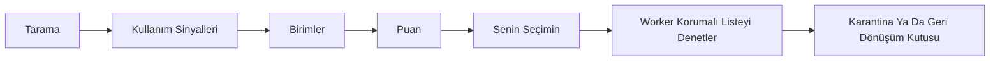

<!-- lang -->

[](README.md)

# DustyBytes

Amacına göre Windows disk temizleyici.

## Önce Sayılar

| Ne | Sayı | Kaynak |
|---|---|---|
| İncelenen açık kaynak depo | 61, yedi raporda | `docs/inceleme/` |
| Geçen test | 337 (tarama 18, sinyal 24, birim 40, güvenlik 46, kaldırma 105, temizlik 27, arayüz 77) | `dotnet test` |
| `C:\` tam tarama, MFT okuyucu | 8,6 sn, 2,84 M dosya | tek makine, n=1 |
| `C:\` tam tarama, `FindFirstFileEx` | 33,2 sn, 2,90 M dosya | aynı makine |
| Bulunan kurulu program | 199 (47 MSI, 53 MSIX) | aynı makine |
| Önizlemede bulunan temizlenebilir | yaklaşık 26,5 GB, 45 bin dosya, hiçbiri silinmedi | aynı makine |

Tarama sayıları tek makineden. MFT yolunun yavaşlatmadığını gösterir; kıyas ölçümü değildir.

## Nedir

DustyBytes bir Windows sürücüsünü tarar ve yer kaplayıp uzun süredir kullanılmayanı listeler. Dosyaları ham ağaç yerine amacına göre toplar: oyun, film, program, derleme klasörü, önbellek. Her grubun boyutu, son kullanım tarihi, güven düzeyi ve gerekçesi vardır. Seçtiğini sen kaldırırsın; hiçbir şey karantina ya da geri dönüşüm kutusu adımı olmadan gitmez. Programlar kendi kaldırıcısıyla kaldırılır, sonra kalıntıları bulunup karantinaya alınır.

## Bunu Windows Zaten Yapmıyor mu?

Depolama Algısı ve Disk Temizleme geçici dosyaları, geri dönüşüm kutusunu ve eski Windows Update dosyalarını temizler. WinDirStat ve WizTree baytların nerede olduğunu gösterir. İkisi de işini iyi yapar. DustyBytes şunları ekler:

- **Klasör değil, amaç.** Bir Steam oyunu `steamapps` altındaki 40 000 dosya değil, launcher'ıyla birlikte tek satırdır.
- **En son ne zaman kullandın.** Launcher kayıtları, Prefetch, UserAssist ve medya geçmişi son kullanım tarihini verir; liste boyut ve boşta kalma süresine birlikte göre sıralanır.
- **Kalıntısız kaldırma.** Üreticinin kaldırıcısı çalıştıktan sonra programa ait kayıt defteri anahtarları, AppData klasörleri, hizmetler ve kısayollar bulunur, puanlanır ve karantinaya alınır.
- **Arayüzün aşamadığı korumalı liste.** Her silme isteği yönetici worker'dan geçer; worker onu sistem, bulut ve paylaşılan çalışma zamanı kurallarına karşı denetler.

## Özellikler

- **İki tarayıcı.** `FindFirstFileEx` her yerde çalışır; MFT okuyucu NTFS'te yönetici yetkisiyle çalışır ve hızlı yeniden tarama için USN imlecini saklar.
- **Birimler.** Dokuz çıkarıcı taramayı oyun, program, film, dizi, geliştirici artığı, önbellek, tarayıcı önbelleği, kurulum dosyası ve sistem artığına çevirir.
- **Kullanım sinyalleri.** Steam, Epic, GOG ve diğer launcher'lar, Prefetch, UserAssist ve son medya; her tarihin kaynağı ve güvenilirliği gösterilir.
- **Karantina.** Kaldırılan aynı sürücüde bir karantina klasörüne manifestiyle taşınır; kalıcı silinene kadar geri yüklenebilir. 3 günü geçenler (varsayılan, ölçülmemiş) yönetici yardımcısının bir sonraki çalışmasında kalıcı silinir; seçenek Karantina ekranından kapatılır.
- **Kaldırıcı.** Win32, MSI ve MSIX programlar; kaldırmadan önce kayıt defteri dışa aktarımı; kalıntılar Yüksek, Orta ya da Düşük güvenle puanlanır.
- **Temizlik kuralları.** 23 JSON kural dosyası (tarayıcı önbellekleri, Windows geçici dosyaları, çökme dökümleri, uygulama önbellekleri) ve isteğe bağlı `winapp2.ini`; ayrıca DISM bileşen temizliği, Windows Update önbelleği ve Teslim İyileştirme.

## Yapmadıkları

- Hiçbir programın sahip olmadığı sahipsiz anahtarları "temizleyen" kayıt defteri temizliği yok.
- `DISM /ResetBase` yok; görünürse bir test derlemeyi düşürür.
- OneDrive ve diğer bulut yer tutucu klasörlerinde silme yok; junction ve sembolik bağlantı izlenmez.
- Doğrudan silme yok: her kaldırma karantina, geri dönüşüm kutusu ya da kendi politikası olan bir kuraldır.
- Birleştirme yok, sürücü güncelleme yok, "bilgisayarı hızlandırma" yok.
- Telemetri yok. Makineden hiçbir şey çıkmaz.
- Henüz imzalı sürüm yok; Windows SmartScreen uyarı verir.

## Kurulum

Windows 10 sürüm 2004 (derleme 19041) ya da sonrası, x64.

En kısa yol [Releases](https://github.com/Teknesyum/DustyBytes/releases) sayfası: `DustyBytes-win-x64.zip`'i indir, yanındaki `.sha256` dosyasıyla karşılaştır, aç ve `DustyBytes.exe`'yi çalıştır. Paket kendi başına çalışır, .NET kurmak gerekmez. Henüz kod imzası yok; SmartScreen ilk açılışta uyarabilir.

Kaynaktan derlemek için .NET 10 SDK gerekir.

Depoyu klonladıktan sonra `Kur.bat`'a çift tıkla. Kurulum penceresini açar, programı derler ve masaüstü kısayolu yazar. `KUR_PROVA=1` verirsen prova koşar: geçici klasöre kurar, kısayol yazmaz.

Elle derlemek için:

```powershell
dotnet publish src/DustyBytes.App -c Release -r win-x64 --self-contained -o bin
```

Arayüz yönetici yetkisi olmadan çalışır. İlk silme, kaldırma ya da MFT taraması worker süreci için bir kez yetki ister.

## Nasıl Çalışır



Tarama, sonra kullanım sinyalleri okunur, sonra birimlere toplanır, sonra puanlanır, sonra sen seçersin, sonra yönetici worker korumalı listeyi denetler, sonra öğe karantinaya ya da geri dönüşüm kutusuna gider.

Puan `log2(1 + MB) × boşta ağırlığı × güven`. Boşta ağırlığı son kullanımdan beri geçen günlerin logaritmasıyla büyür ve iki yılda 1'e ulaşır; bilinmeyen tarih 0,5 sayılır. Arayüz süreci dosyalara dokunmaz. İsteklerini yalnız aynı kullanıcı SID'inin açabildiği adlandırılmış kanaldan gönderir; worker ayrıca çağıranın kendi üst süreci olduğunu denetler. Diğer akışlar [docs/diagram.md](docs/diagram.md) içinde.

## Program Ne Yaptığını Gösterir

- **Genel Bakış** — sürücü doluluğu, o anki klasörle tarama ilerlemesi ve en büyük birimler. *(ekran görüntüsü)*
- **Öneriler** — puana göre sıralı birimler; her birinde boyut, son kullanım, güven ve gerekçe. *(ekran görüntüsü)*
- **Harita** — taramanın kareleştirilmiş ağaç haritası; tıklayınca bir düzey iner. *(ekran görüntüsü)*
- **Programlar** — boyut ve son kullanımıyla kurulu programlar; kaldırma, bir şey silinmeden önce kalıntı listesini gösterir. *(ekran görüntüsü)*
- **Temizlik** — boyut ve dosya sayısı önizlemeli kural grupları. *(ekran görüntüsü)*
- **Karantina** — neyin ne zaman kaldırıldığı ve geri yükleme düğmesi. *(ekran görüntüsü)*
- **Güncelleme rozeti** — sağ üstte nokta ve "Güncelleme": sarı yeni sürüm çıktı demek, tıklayınca arkada iner; yeşil indi ve SHA-256 doğrulandı demek, tıklayınca kurulur. Kurmadan önce sorar ve programın kapanıp yeni sürümle açılacağını söyler. *(ekran görüntüsü)*

## Geliştirici İçin

```powershell
dotnet build DustyBytes.slnx
```

```powershell
dotnet test DustyBytes.slnx
```

`DUSTYBYTES_DRYRUN=1` verirsen her silme, kaldırma ve temizlik yolu diske dokunmadan koşar.

| Proje | Görev |
|---|---|
| `DustyBytes.Core` | Model, puanlama, korumalı liste, IPC mesajları |
| `DustyBytes.Scan` | `FindFirstFileEx` tarayıcı, MFT okuyucu, USN günlüğü |
| `DustyBytes.Signals` | Launcher kütüphaneleri, Prefetch, UserAssist, medya |
| `DustyBytes.Units` | Taramayı birimlere çeviren çıkarıcılar |
| `DustyBytes.Clean` | Karantina, kaldırıcı, kalıntılar, temizlik kuralları |
| `DustyBytes.Worker` | Yönetici worker, adlandırılmış kanal sunucusu ve istemcisi |
| `DustyBytes.App` | Avalonia 11 arayüzü |

Kurallar `rules/` altında JSON olarak durur ve çalıştırılabilir dosyanın yanına kopyalanır. Kod AOT uyumludur: yalnız `System.Text.Json` kaynak üreticileri, yansıma yok. Alınan algoritma ve veriler [docs/licenses.md](docs/licenses.md) içinde listelidir.

## Katkı

Önce bir issue aç, sonra küçük bir pull request gönder. Kod, commit ve issue dili İngilizce. Katkılar projenin lisansı AGPL-3.0-or-later altında kabul edilir; CLA ya da DCO yok. Yeni temizlik kuralları `rules/cleaners/` altında JSON dosyası olarak memnuniyetle alınır. Sponsorluk geliştirmeyi sürdürür; rozet bu sayfanın altında.

## Lisans

AGPL-3.0-or-later. Bkz. [LICENSE](LICENSE).

<!-- signature -->
<div align="center">

<a href="https://github.com/sponsors/Teknesyum"></a>
&nbsp;
<a href="LICENSE"></a>

</div>
