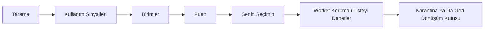

<!-- lang -->

[](README.md)

# DustyBytes

Amacına göre Windows disk temizleyici.

## Önce Sayılar

| Ne | Sayı | Kaynak |
|---|---|---|
| İncelenen açık kaynak depo | 61, yedi raporda | `docs/inceleme/` |
| Geçen test | 869 (tarama 49, sinyal 24, birim 71, güvenlik 134, kaldırma 222, temizlik 79, arayüz 290) | `dotnet test` |
| `C:\` tam tarama, MFT okuyucu | 8,6 sn, 2,84 M dosya | tek makine, n=1 |
| `C:\` tam tarama, `FindFirstFileEx` | 33,2 sn, 2,90 M dosya | aynı makine |
| Bulunan kurulu program | 199 (47 MSI, 53 MSIX) | aynı makine |
| Önizlemede bulunan temizlenebilir | yaklaşık 26,5 GB, 45 bin dosya, hiçbiri silinmedi | aynı makine |

Tarama sayıları tek makineden. MFT yolunun yavaşlatmadığını gösterir; kıyas ölçümü değildir.

## Nedir

DustyBytes bir Windows sürücüsünü tarar ve yer kaplayıp uzun süredir kullanılmayanı listeler. Dosyaları ham ağaç yerine amacına göre toplar: oyun, film, program, derleme klasörü, önbellek. Her grubun boyutu, son kullanım tarihi, güven düzeyi ve gerekçesi vardır. Seçtiğini sen kaldırırsın; hiçbir şey karantina ya da geri dönüşüm kutusu adımı olmadan gitmez. Programlar kendi kaldırıcısıyla kaldırılır, sonra kalıntıları bulunup karantinaya alınır.

## Bunu Windows Zaten Yapmıyor mu?

Depolama Algısı ve Disk Temizleme geçici dosyaları, geri dönüşüm kutusunu ve eski Windows Update dosyalarını temizler. WinDirStat ve WizTree baytların nerede olduğunu gösterir. İkisi de işini iyi yapar. DustyBytes şunları ekler:

- **Klasör değil, amaç.** Bir Steam oyunu `steamapps` altındaki 40 000 dosya değil, launcher'ıyla birlikte tek satırdır.
- **En son ne zaman kullandın.** Launcher kayıtları, Prefetch, UserAssist ve medya geçmişi son kullanım tarihini verir; liste boyut ve boşta kalma süresine birlikte göre sıralanır.
- **Kalıntısız kaldırma.** Üreticinin kaldırıcısı çalıştıktan sonra programa ait kayıt defteri anahtarları, AppData klasörleri, hizmetler ve kısayollar bulunur, puanlanır ve karantinaya alınır.
- **Büyüğü adıyla söyler.** Klasör yolu yerine "LM Studio · Dil modeli, 40 GB"; yanında silinirse ne olacağını anlatan tek sade cümle. 1 GB altı, istemedikçe öne çıkmaz.
- **Tek tık, onay yok.** Her kartın kendi düğmesi var; hemen karantinaya alır, bildirimde Geri al çıkar.
- **Arayüzün aşamadığı korumalı liste.** Her silme isteği yönetici worker'dan geçer; worker onu sistem, bulut ve paylaşılan çalışma zamanı kurallarına karşı denetler.

## Özellikler

- **İki tarayıcı.** `FindFirstFileEx` her yerde çalışır; MFT okuyucu NTFS'te yönetici yetkisiyle çalışır ve hızlı yeniden tarama için USN imlecini saklar.
- **Birimler.** On çıkarıcı taramayı oyun, program, uygulama içeriği, film, dizi, geliştirici artığı, önbellek, tarayıcı önbelleği, kurulum dosyası ve sistem artığına çevirir.
- **Bilinen içerik.** `rules/known-content.json` 24 ağır yeri adıyla tanır: yerel yapay zekâ modelleri (LM Studio, Ollama, Hugging Face, Jan, GPT4All, InvokeAI), Android emülatörleri, Steam gölgelendirici önbelleği, Adobe önbellekleri ve paket önbellekleri (npm, pnpm, Yarn, NuGet, Gradle, Maven, pip, uv, Cargo, Go). Docker, WSL ve iPhone yedekleri bilerek dışarıda: bunları dosya taşıyarak kaldırmak yanlış yol.
- **Kullanım sinyalleri.** Steam, Epic, GOG ve diğer launcher'lar, Prefetch, UserAssist ve son medya; her tarihin kaynağı ve güvenilirliği gösterilir.
- **Karantina.** Kaldırılan aynı sürücüde bir karantina klasörüne manifestiyle taşınır; kalıcı silinene kadar geri yüklenebilir. 7 günü geçenler yönetici yardımcısı çalışırken kalıcı silinir: açıldığında ve sonra saatte bir. Karantina ekranı her şeyi tek tıkla boşaltır; otomatik silme de oradan kapatılır.
- **Kaldırıcı.** Win32, MSI ve MSIX programlar; kaldırmadan önce kayıt defteri dışa aktarımı; kalıntılar Yüksek, Orta ya da Düşük güvenle puanlanır.
- **Temizlik kuralları.** 23 JSON kural dosyası (tarayıcı önbellekleri, Windows geçici dosyaları, çökme dökümleri, uygulama önbellekleri) ve isteğe bağlı `winapp2.ini`; ayrıca DISM bileşen temizliği, Windows Update önbelleği ve Teslim İyileştirme.
- **Bütün sürücüler.** Her sabit sürücü kendi diziniyle taranır; Genel bakışta "Tümü" varsayılan bir sürücü seçici var.
- **Silmeden yer aç.** "Küçült", bir oyunu ya da programı Windows'un saydam sıkıştırmasıyla küçültür (NTFS, geri alınabilir). Uzun süredir açılmayan OneDrive dosyaları "yalnız çevrimiçi" olabilir: bulutta kalır, açınca yeniden iner.
- **Yeni kaynaklar.** Geri Dönüşüm Kutusu, 90 gündür açılmamış indirilenler (karantinaya gider, bir anda kalıcı silinmez) ve hazırda bekletme dosyası.
- **Kopya dosyalar.** Taramadan sonra arka planda bulunur; her grupta seçtiğiniz bir kopya kalır. Kopyalar yalnız karantinaya gider, worker kaldırma anında içeriği yeniden doğrular.
- **Zorla ve toplu kaldırma.** Kaldırıcısı olmayan ya da bozuk bir program zorla kaldırılabilir: yalnız yüksek güvenli izler karantinaya gider, kayıt anahtarları önce yedeklenir. Birden çok program tek sırada, kaldırıcı izin veriyorsa sessizce kaldırılır.
- **Hatırlatma.** Kullanıcı düzeyindeki haftalık denetim boş alanı ölçer, azsa Windows bildirimi gösterir; hiçbir şey silmez. Explorer sağ tık menüsünde "DustyBytes ile incele" var.
- **Tek düğme.** Genel bakışta "Güvenle silinebilir: X — Temizle": önbellek, geçici dosya ve benzeri kişisel olmayan şeyler, tek tık, soru yok. Tarama bitene kadar kapalı kalır ve nedenini söyler. "Daha fazla yer: Y GB, K karar" gerisini kümeler hâlinde sorar ("4 oyun, 12+ aydır açılmamış, 112 GB"); Enter, Esc ve oklarla.
- **Hedef.** "Bana 60 GB lazım" en az acı veren planı kurar: önce güvenli küme, sonra en uzun süredir kullanılmayan. Ne kadarının şimdi boşalacağını, ne kadarının karantinada bekleyeceğini söyler.
- **Dürüst sayaç.** "Şimdi boşalan X · Karantinada Y (N gün sonra boşalır)" tahminden değil, worker'ın gerçekten sildiği bayttan gelir. "Şimdi yer aç" karantinayı iki basışla boşaltır.
- **Bütün temizliği geri al.** Her temizlik bir oturumdur. Karantina ekranı oturuma göre kümelenir, "Hepsini geri al" vardır; her temizlik önce/sonra paneliyle biter.
- **Önizleme = yürütme.** Temizlik kurallarında listeyi worker çıkarır, ekran onu gösterir, yalnız o listedeki dosyalara dokunulur. Sonuç satırı: "Gösterilen 1.204 dosya, silinen 1.198, atlanan 6 (kullanımda)". Tam liste worker'da kalır.
- **Ne büyüdü?** Klasör başına küçük bir anlık görüntü 30 gün saklanır; Genel bakış son taramadan beri en çok büyüyen üç klasörü adıyla söyler, haftalık bildirim de anar.
- **Sade açıklama.** Her kural ve her öğe türü "Bu nedir?", "Silersem ne olur?", "Geri gelir mi?" sorularını yanıtlar. Tarayıcı çerezleri ayrı ve işaretsiz bir seçenektir; sitelerden çıkış yapılmaz.
- **Sessiz kaldırma.** MSI, Inno Setup, NSIS ve Squirrel kaldırıcıları tanınır, toplu kuyrukta penceresiz çalışır; tanınmayanlar görünür çalışır. Paylaşılan çalışma zamanları (.NET, VC++, DirectX, Java, WebView2) işaretsiz başlar.
- **Bütçeli bildirim.** Haftada en çok bir tane, yalnız 5 GB ya da daha fazla açılabiliyorsa ya da boş alan %10'un altındaysa. "Güvenli temizle" bildirimin içinden güvenli kümeyi çalıştırır; "Bu hafta sus" ve "Bir daha gösterme" de bildirimdedir.
- **Yerel ölçüm.** Uygulama veri klasöründeki `olcum.jsonl` ilk karta süreyi, ilk boşalan bayta süreyi, karar ve tık sayısını tutar. Hiçbir şey makineden çıkmaz.

## Yapmadıkları

- Hiçbir programın sahip olmadığı sahipsiz anahtarları "temizleyen" kayıt defteri temizliği yok.
- `DISM /ResetBase` yok; görünürse bir test derlemeyi düşürür.
- OneDrive ve diğer bulut yer tutucu klasörlerinde silme yok; junction ve sembolik bağlantı izlenmez.
- Doğrudan silme yok: her kaldırma karantina, geri dönüşüm kutusu ya da kendi politikası olan bir kuraldır.
- Birleştirme yok, sürücü güncelleme yok, "bilgisayarı hızlandırma" yok.
- Telemetri yok. Makineden hiçbir şey çıkmaz.
- Sürümler kod imzalı değil. İlk açılışta SmartScreen "Windows bilgisayarınızı korudu" der: **Ek bilgi**, sonra **Yine de çalıştır**. `.sha256` dosyası indirilenin yayımlanan dosya olduğunu kanıtlar.

## Kurulum

**Önerilen: Teknesyum Base Pro (Windows).** Bu depo özeldir; özel depoları yalnız [Teknesyum Base](https://github.com/Teknesyum/Teknesyum-Base)'in Pro sürümü listeler, herkese açık Base yalnız açık depoları gösterir. Base Pro'yu açın, listeden **DustyBytes** uygulamasını bulup kurun. Base sonradan güncellemeyi ve kaldırmayı da yapar, yönetici hakkı gerekmez.

**Ya da elle kurun.**

Windows 10 sürüm 2004 (derleme 19041) ya da sonrası, x64.

**Kurucuyla.** Bu depodaki `Kur.bat` ile `kur-dustybytes.ps1`'i aynı klasöre koy, `Kur.bat`'a çift tıkla. GitHub'dan son sürümü sorar, `DustyBytes-win-x64.zip`'i `.sha256` dosyasıyla birlikte indirir; özet tutmazsa kurmaz.

Program `%LOCALAPPDATA%\Programs\DustyBytes` klasörüne gider (Kur'a basmadan önce Değiştir ile başka yer seçilir), yönetici yetkisi gerekmez. Masaüstüne ve Başlat menüsüne kısayol yazar. Güncellemede açık kopyayı kapatır, yenisi yerine oturana dek eskisini saklar. Günlük: `%LOCALAPPDATA%\DustyBytes\kurulum.log`.

`KUR_PROVA=1` verirsen prova koşar: geçici klasöre kurar, kısayol yazmaz. `KUR_OTOMATIK=1` pencere açmadan koşar, 0 ya da 1 ile çıkar.

**Elle.** [Releases](https://github.com/Teknesyum/DustyBytes/releases) sayfasından `DustyBytes-win-x64.zip`'i indir, yanındaki `.sha256` dosyasıyla karşılaştır, aç ve `DustyBytes.exe`'yi çalıştır. Paket kendi başına çalışır, .NET kurmak gerekmez. Kod imzası yok; SmartScreen ilk açılışta uyarır: **Ek bilgi**, sonra **Yine de çalıştır**.

**Kaynaktan.** .NET 10 SDK gerekir:

```powershell
dotnet publish src/DustyBytes.App -c Release -r win-x64 --self-contained -o bin
```

Arayüz yönetici yetkisi olmadan çalışır. İlk silme, kaldırma ya da MFT taraması worker süreci için bir kez yetki ister.

## Nasıl Çalışır



Tarama, sonra kullanım sinyalleri okunur, sonra birimlere toplanır, sonra puanlanır, sonra sen seçersin, sonra yönetici worker korumalı listeyi denetler, sonra öğe karantinaya ya da geri dönüşüm kutusuna gider.

Puan `log2(1 + MB) × boşta ağırlığı × güven`. Boşta ağırlığı son kullanımdan beri geçen günlerin logaritmasıyla büyür ve iki yılda 1'e ulaşır; bilinmeyen tarih 0,5 sayılır. Arayüz süreci dosyalara dokunmaz. İsteklerini yalnız aynı kullanıcı SID'inin açabildiği adlandırılmış kanaldan gönderir; worker ayrıca çağıranın kendi üst süreci olduğunu denetler. Diğer akışlar [docs/diagram.md](docs/diagram.md) içinde.

## Program Ne Yaptığını Gösterir

- **Genel Bakış** — sürücü doluluğu, o anki klasörle tarama ilerlemesi ve en büyük birimler. *(ekran görüntüsü)*
- **Öneriler** — puana göre sıralı birimler; her birinde boyut, son kullanım, güven ve gerekçe. *(ekran görüntüsü)*
- **Harita** — taramanın kareleştirilmiş ağaç haritası; tıklayınca bir düzey iner. *(ekran görüntüsü)*
- **Programlar** — boyut ve son kullanımıyla kurulu programlar; kaldırma, bir şey silinmeden önce kalıntı listesini gösterir. *(ekran görüntüsü)*
- **Temizlik** — boyut ve dosya sayısı önizlemeli kural grupları. *(ekran görüntüsü)*
- **Karantina** — neyin ne zaman kaldırıldığı ve geri yükleme düğmesi. *(ekran görüntüsü)*
- **Güncelleme rozeti** — sağ üstte nokta ve "Güncelleme": sarı yeni sürüm çıktı demek, tıklayınca arkada iner; yeşil indi ve SHA-256 doğrulandı demek, tıklayınca kurulur. Kurmadan önce sorar ve programın kapanıp yeni sürümle açılacağını söyler. *(ekran görüntüsü)*

## Geliştirici İçin

```powershell
dotnet build DustyBytes.slnx
```

```powershell
dotnet test DustyBytes.slnx
```

`DUSTYBYTES_DRYRUN=1` verirsen her silme, kaldırma ve temizlik yolu diske dokunmadan koşar.

| Proje | Görev |
|---|---|
| `DustyBytes.Core` | Model, puanlama, korumalı liste, IPC mesajları |
| `DustyBytes.Scan` | `FindFirstFileEx` tarayıcı, MFT okuyucu, USN günlüğü |
| `DustyBytes.Signals` | Launcher kütüphaneleri, Prefetch, UserAssist, medya |
| `DustyBytes.Units` | Taramayı birimlere çeviren çıkarıcılar |
| `DustyBytes.Clean` | Karantina, kaldırıcı, kalıntılar, temizlik kuralları |
| `DustyBytes.Worker` | Yönetici worker, adlandırılmış kanal sunucusu ve istemcisi |
| `DustyBytes.App` | Avalonia 11 arayüzü |

Kurallar `rules/` altında JSON olarak durur ve çalıştırılabilir dosyanın yanına kopyalanır. Kod AOT uyumludur: yalnız `System.Text.Json` kaynak üreticileri, yansıma yok. Alınan algoritma ve veriler [docs/licenses.md](docs/licenses.md) içinde listelidir.

## Katkı

Önce bir issue aç, sonra küçük bir pull request gönder. Kod, commit ve issue dili İngilizce. Katkılar projenin lisansı AGPL-3.0-or-later altında kabul edilir; CLA ya da DCO yok. Yeni temizlik kuralları `rules/cleaners/` altında JSON dosyası olarak memnuniyetle alınır. Sponsorluk geliştirmeyi sürdürür; rozet bu sayfanın altında.

## Lisans

AGPL-3.0-or-later. Bkz. [LICENSE](LICENSE).

<!-- signature -->
<div align="center">

<a href="https://github.com/sponsors/Teknesyum"></a>
&nbsp;
<a href="LICENSE"></a>

</div>
