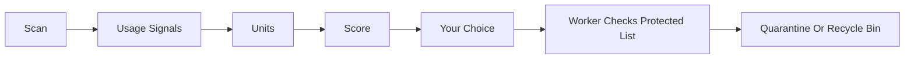
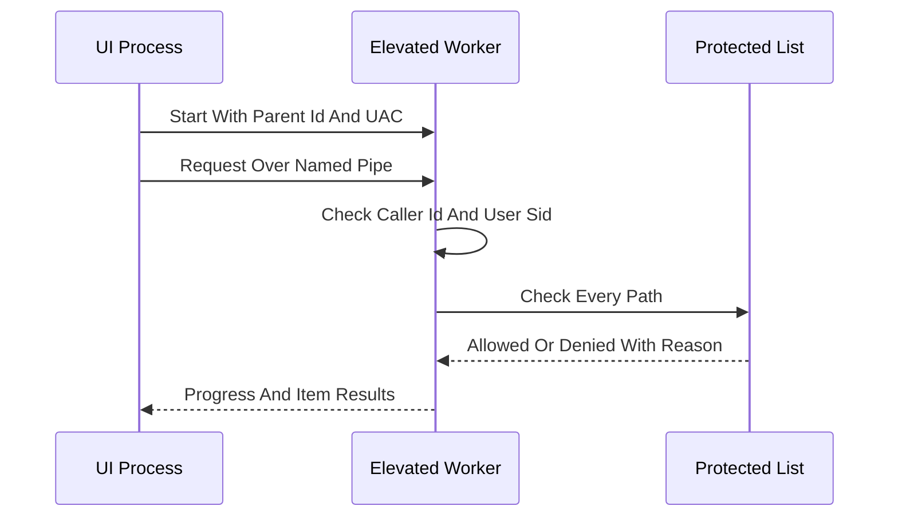
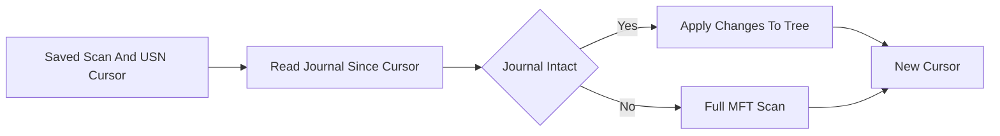

# Diagrams

Every main flow described in the README has one diagram here. A new flow adds a section.

## Scan To Removal

Scan, then usage signals, then units, then score, then the user's choice, then the worker's protected list check, then quarantine or the recycle bin.

## UI And Worker

The UI starts the worker once through UAC, sends a request over the named pipe, the worker checks the caller and the user SID, checks every path against the protected list, and returns progress and a result per item.

## Uninstall

The user picks a program, a restore point and a registry export are made, the vendor uninstaller runs, leftovers are scanned and scored, the user chooses, and the chosen leftovers go to quarantine.

## Quick Rescan

The saved scan and its USN cursor are loaded, the journal is read since the cursor, changes are applied to the tree if the journal is intact, otherwise a full MFT scan runs, and a new cursor is saved.
